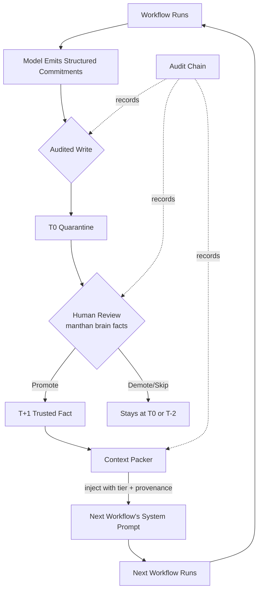

<div align="center">

# ManthanOS

### Trust-gated continuity for AI-assisted software engineering.

<p align="center">
  <i>The problem isn't that AI forgets syntax.<br/>
  The problem is that AI forgets <b>your project</b>.</i>
</p>

<sub>An audit-first continuity runtime for long-lived AI engineering workflows.</sub>

<sub>
  <a href="#vision">Vision</a> ·
  <a href="#why-manthanos">Why ManthanOS</a> ·
  <a href="#the-continuity-loop">Continuity Loop</a> ·
  <a href="#architecture">Architecture</a> ·
  <a href="#live-experiment-results">Experiment Results</a> ·
  <a href="#philosophy">Philosophy</a> ·
  <a href="#roadmap">Roadmap</a>
</sub>

</div>

---

## Research-grade prototype

ManthanOS is currently a research-grade local prototype, not a production-safe tool. Specifically:

- API keys are stored in plaintext at `~/.config/manthan/api-keys.env` or `.manthan/secrets.env`. OS-keychain integration is deferred.
- Adapter packages run in-process with full Node.js privileges. Do not install third-party adapters until sandboxing lands.
- The audit chain detects accidental corruption only. A local-disk attacker can rewrite the log and recompute hashes.
- The hygiene loop has been validated against synthetic corpora only.
- The cross-model thesis has not been empirically validated; see [`docs/TRUTH_CHECKPOINT.md`](docs/TRUTH_CHECKPOINT.md) and [`docs/STABILIZATION.md`](docs/STABILIZATION.md).

Until OS-keychain integration and adapter sandboxing land, do not install third-party adapters and do not run this against repositories you do not personally control.

---

## Vision

Modern AI coding tools share one structural failure:

<div align="center">
<h3><i>continuity collapse.</i></h3>
</div>

Every session starts over. The model that solved your auth flow last Tuesday has no memory of it on Wednesday. By month three on the same codebase, an engineer working with AI has been forced into the same loop, repeatedly:

- re-explain the architecture
- restate prior assumptions
- recover decisions from chat history or a teammate's memory
- correct contradictions the model invents
- watch the design quietly drift away from itself

The models are excellent at generating responses. They are weak at maintaining **trusted continuity** across long-lived engineering work.

ManthanOS exists for one reason: to make that continuity a first-class, auditable, replayable property of the project — not an accident of which chat window happens to be open.

---

## Why "ManthanOS"

The name comes from **Samudra Manthan** — the Sanskrit story of *churning* the cosmic ocean. Many forces, in tension, refining over time, eventually extract clarity and value out of chaos.

That is what good software engineering already is:

- iteration
- contradiction
- refinement
- review
- correction
- accumulated commitments

ManthanOS treats project cognition the same way. Not as magic memory. Not as autonomous intelligence. Not as a "neural" anything. But as the disciplined, deliberate output of:

- a workflow that produces structured commitments
- a human who decides which commitments to trust
- a runtime that preserves those decisions for the next session

The result is **trusted cognition through refinement** — extracted slowly, verified explicitly, kept across time.

---

## What ManthanOS Actually Is

ManthanOS is:

- ✅ A **trust-gated project continuity engine**
- ✅ A **replayable AI workflow runtime**
- ✅ An **audit-first engineering memory layer**
- ✅ A **deterministic context system** for long-lived AI workflows
- ✅ A **cross-platform substrate** (Windows, macOS, Linux — equal)

ManthanOS is **not**:

- ❌ "AGI infrastructure"
- ❌ An autonomous coding swarm
- ❌ A chatbot wrapper
- ❌ A prompt-history utility
- ❌ A hidden orchestration black box
- ❌ A multi-agent platform pretending to be an OS

The earlier "AI engineering operating system" framing was retired after empirical evidence narrowed the validated claim. The smaller product is the real one.

---

## The Core Insight

Most AI coding tools optimize for:

> *"Generate one smart response."*

ManthanOS optimizes for:

> *"Preserve trusted project continuity over time."*

That single shift in objective changes the entire system architecture. It is the reason ManthanOS has a hash-chained audit log instead of chat scrollback, a trust gate instead of automatic memory, and a packer that distinguishes `[T+1 fact, src=wf_…]` from `<repository_text kind="git_diff">`.

---

## Status

**Phase 1.7 — Substrate complete; continuity loop empirically validated.**

### Shipped

- ✅ Replayable workflow runtime
- ✅ Hash-chained audit log (detects accidental corruption; verifies on startup. Not tamper-evident against a local-disk attacker — see Research-grade prototype section.)
- ✅ Trust-gated fact promotion (`promote` / `demote` / `undo-correction`)
- ✅ Project Brain (SQLite-backed, indexed, six trust tiers)
- ✅ Two Claude integrations:
  - API-key adapter (`@anthropic-ai/sdk`)
  - **Claude Code CLI adapter** — uses your subscription quota; no API key required
- ✅ Structured workflow persistence with crash-consistent writes
- ✅ Provenance + tier rendered into every future workflow's bundle
- ✅ Cross-platform PAL (canonical seam by convention; lint enforcement deferred)
- ✅ Live A/B continuity experiment (2026-05-15)

### Intentionally Deferred

- ⏳ Multi-provider orchestration
- ⏳ Debate engine
- ⏳ Autonomous workflows
- ⏳ Vector retrieval / embedding-based memory
- ⏳ Background agents / daemons
- ⏳ Plugin marketplace
- ⏳ Swarm routing

These are **not on the active roadmap.** They become candidates only if Phase 2/3 evidence shows continuity alone is insufficient.

---

## The Continuity Loop

The single mechanic that defines the product:



Nothing enters a future workflow's trusted prompt without **a human explicitly deciding it should.** That rule is the product. The runtime around it exists to make the loop reliable, replayable, and safe.

---

## Architecture

```text
┌──────────────────────────────────────────────────────────────┐
│                         manthan CLI                          │
│   init  ·  plan  ·  brain (stats/facts/promote/demote/undo)  │
│                       replay  ·  doctor                      │
└────────────────────────────┬─────────────────────────────────┘
                             │
              ┌──────────────▼──────────────┐
              │      Orchestrator Core      │
              │  Workflow Runner            │
              │  Safety Gate                │
              │  Cost / Budget Enforcement  │
              └──┬──────────┬───────────────┘
                 │          │
    ┌────────────▼──┐   ┌───▼─────────────┐   ┌────────────────┐
    │ Context Packer│   │  Project Brain  │◄──┤  Audit Chain   │
    │ (charter,     │   │  - facts        │   │  hash-chained, │
    │  trusted,     │   │  - decisions    │   │  replayable,   │
    │  quarantine,  │   │  - open issues  │   │  fsync'd       │
    │  diff, source)│   │  - workflows    │   └────────────────┘
    └───────┬───────┘   └───┬─────────────┘
            │               │
            └──────┬────────┘
                   │
       ┌───────────▼────────────┐
       │     Adapter Surface    │
       │  (uniform AgentAdapter)│
       └─┬──────────────────┬───┘
         │                  │
   ┌─────▼─────┐    ┌───────▼────────┐
   │ Claude    │    │ Claude Code    │
   │ via API   │    │ via CLI subs.  │
   │ key       │    │ (no key needed)│
   └───────────┘    └────────────────┘
                                                  ┌──────────────┐
                                                  │  Platform    │
                                                  │  Abstraction │
                                                  │  Layer (PAL) │
                                                  │  win/mac/lnx │
                                                  └──────────────┘
```

The PAL is the **canonical seam** through which the runtime touches the operating system. Above-PAL code is intended to be OS-agnostic. **Lint enforcement of the seam is deferred** — raw Node `node:fs`/`node:path` imports remain in several files; the PAL is convention today, not a build-time guarantee. See `docs/PLATFORM_LAYER.md` for the migration plan.

---

## The Project Brain

The brain is the heart of the runtime, but it is the most ordinary heart possible: a SQLite database with explicit tables and explicit indexes.

It holds:

| Table | Purpose |
|---|---|
| `semantic_facts` | Project commitments at six trust tiers (T+3 → T-2) |
| `decisions` | Signed architectural choices |
| `open_issues` | Unresolved risks surfaced by prior workflows |
| `workflows` | Run history with cost, latency, tokens |
| `audit_events` | Hash-chained record of every effectful action |
| `blobs` | Content-addressed payloads (request/response bodies) |
| `context_snapshots` | What the model saw, for each run |
| `corrective_signals` | Records of human rejections (informs future runs) |
| `contradictions` | Surface pairs of conflicting facts (Phase 3) |

Critically: **the brain does not assume model outputs are true.** Every fact begins at T0 (quarantine) and stays there until a human promotes it.

This is the difference between "memory" and "trusted memory."

---

## Trust Promotion Lifecycle

```text
                 ┌──────────────┐
                 │  T+3 Signed  │   ◄── via `decision sign` (Phase 3)
                 └──────┬───────┘
                        │
                 ┌──────▼───────┐
                 │ T+2 Trusted  │   ◄── via `brain promote` (corroborated)
                 │ (corroborated)│
                 └──────┬───────┘
                        │
                 ┌──────▼───────┐   ◄── via `brain promote` (human gate)
                 │  T+1 Active  │       │
                 └──────┬───────┘       │ default bundle entries
                        │               │
        ┌───────────────▼───────────────┘
        │
 ┌──────▼───────┐
 │ T0 Quarantine│   ◄── all new facts land here. Not in default prompt.
 └──┬──┬────────┘
    │  │
    │  └─── via `brain demote` ───┐
    │                             ▼
    │                      ┌─────────────┐
    │                      │ T-2 Reversed│
    │                      └─────────────┘
    │
    └─── automatic on contradiction (Phase 3) ───┐
                                                  ▼
                                          ┌──────────────┐
                                          │ T-1          │
                                          │ Contradicted │
                                          └──────────────┘
```

Forbidden transitions enforced in code:

- Auto-promotion: refused.
- Model self-promotion: structurally impossible (only human-invoked commands write `brain.correction` events).
- T+3 via the simple `promote` command: refused (must go through signed-decision flow).
- T-1 / T-2 → trusted: refused without explicit resolution.

Every transition writes a `brain.correction` audit event. Every transition is undoable within 7 days via `manthan brain undo-correction <seq>`.

---

## Replay & Audit Chain

```text
audit_events table  +  .manthan/audit.log JSONL  +  blob store
        │                       │                       │
        │  hash-chained ────────┤                       │
        │  prev_hash → self_hash│                       │
        │                       │                       │
        └───────────────┬───────┘                       │
                        │                               │
              ┌─────────▼─────────┐                     │
              │ verifyChain() on  │                     │
              │ every startup     │                     │
              │ + on demand       │                     │
              └─────────┬─────────┘                     │
                        │                               │
                        ▼                               │
              ┌───────────────────┐                     │
              │  manthan replay   │◄────────────────────┘
              │  <runId>          │  blobs content-addressed
              └───────────────────┘  by sha256(canonical(payload))
```

Every effectful action — provider call, file write, git operation, trust mutation — passes through `auditedWrite()`. That function:

1. Persists payload as a content-addressed blob (atomic temp + rename + fsync).
2. Inserts an audit row inside a SQLite transaction.
3. Appends a JSONL line for human inspection (rebuildable from SQLite if lost).

The result: **no hidden AI mutations, no silent prompt rewriting, no invisible memory injection by the runtime.** If it happened, it's in the log. If it's in the log, it's inspectable from audit + blobs. (Bundle-hash recomputation — "byte-identical replay verification" in the strict sense — is not yet implemented; see [`docs/TRUTH_CHECKPOINT.md`](docs/TRUTH_CHECKPOINT.md) §2.4. These guarantees apply to passive observation; they do **not** defend against a local attacker with disk-write access — see [§Security posture](#security-posture-research-grade-detailed) below.)

Crash semantics are specified end-to-end in [`docs/CRASH_CONSISTENCY.md`](docs/CRASH_CONSISTENCY.md) — including Windows AV-race retry, fsync ordering, and recovery rules for every interruption point.

---

## Security posture (research-grade, detailed)

The [§Research-grade prototype](#research-grade-prototype) section at the top of this document is a summary. This section is the precise scope of that summary: what the runtime does and does not defend against, what is operationally unsafe today, the assumptions the implementation makes about its operator, and the conditions under which the project is reasonably usable.

This is not an appendix of minor caveats. It is the load-bearing boundary between honest claims and overstatement. Read it before installation if installation is being considered.

### Threats the runtime defends against

| Threat | Mechanism | Status |
|---|---|---|
| Accidental corruption of an `audit_events` row | Hash-chained `prev_hash → self_hash`; `verifyChain()` on every workspace open and on `manthan doctor` | **Verified** — tests in `packages/memory/tests/audited-write.test.ts`; exercised in every multi-event run during stabilization |
| Brain row out of sync with the audit event that produced it | A single SQLite transaction wraps the blob write + audit insert + brain mutation | **Verified** — transaction boundaries in `auditedWrite` |
| Model self-promotion of a fact | Trust transitions only occur via human-invoked CLI commands; the orchestrator does not call `applyTransition` on its own initiative | **Verified** — code path is human-invoked only; tests confirm |
| Single-process race on a workspace | `AsyncMutex` in `auditedWrite` serializes writes within one Node process | **Partially verified** — in-process only; no cross-process locking; concurrent `manthan` invocations against the same workspace are not blocked |
| Runtime-side silent rewriting of recorded data | Every effectful action passes through `auditedWrite`; no alternative write path exists in the orchestrator | **Verified** for the runtime's own behavior; **does not** apply to an external actor with disk access |
| Model output overrun of the trusted prompt layer | Adaptive shaping caps trusted-fact tokens and reports every omission with a reason | **Verified** mechanically — whether this preserves *useful* continuity is the open Phase 3 question |

### Threats the runtime does NOT defend against

| Threat | Why not |
|---|---|
| **Malicious local-disk attacker** | The hash chain detects accidental flips. A user or process with write access to `.manthan/audit.log` and `.manthan/audit/blobs/` can rewrite the log and recompute every subsequent hash. There is no external anchoring (no transparency log, no signed checkpoint, no second-party witness). |
| **Malicious npm dependency** | Adapter packages and their transitive dependencies run in-process with full Node.js privileges. A compromised dependency can read `~/.ssh/`, `~/.aws/credentials`, the SQLite brain, the audit blobs, and the plaintext API key file. `pnpm audit` is the only line of defense and the operator must run it. |
| **Malicious adapter** | Same mechanism. Adapter packages are not sandboxed. `SAFETY_MODEL.md` calls capability manifests "advisory metadata, not enforcement"; that is the current state. The only mitigation today is restricting the installed adapter set to the four packages shipped in this repository. |
| **Prompt injection via human-approved facts** | `manthan brain review` lists T0 candidates with provenance and decay hints. There is no automated injection-pattern scan at promotion time. An attacker who can land an injection payload in repository content (PR body, test output, commit message) and persuade the operator to approve it has obtained durable system-prompt control until the fact is manually demoted. |
| **Prompt injection via untrusted repository layers** | `<repository_text>` XML wrap-around is a passive boundary against the model treating data as instruction. It is not a real boundary against a jailbreak embedded in repo content. Treat any `<repository_text>` content with the same caution as a user-supplied prompt. |
| **Secret exfiltration via output channels** | The redactor catches statically-patterned secrets (AWS keys, GitHub tokens, etc.). A model that encodes, paraphrases, splits, or otherwise transforms a secret will not be caught. The redactor is best-effort. |
| **Shell-command exploitation through pattern evasion** | The shell denylist (`rm -rf /`, `curl|sh`, similar) is universally bypassable: aliases, variable expansion (`c$()url`), base64-decoded payloads, scripts dropped elsewhere on the filesystem. Treat the denylist as advisory — it discourages a careless mistake; it stops nothing intentional. |
| **TOCTOU symlink race** | `auditedWrite` `lstat`s the target path before writing, as a defense against symlink swaps. A concurrent attacker can win the race between the `lstat` check and the `open()`/`write()` calls. The window is small but real on multi-tenant systems. |
| **Cross-process or multi-host write races** | `AsyncMutex` is intra-process. Two concurrent `manthan` invocations against the same workspace will interleave non-deterministically; the audit chain remains consistent within each process, but the relative order across processes is undefined. |
| **Cost abuse from accumulated workflow invocations** | `--budget` enforcement is per-`manthan plan` invocation. There is no daily quota cap, no aggregate spend monitor across a session, and no per-workspace ceiling. A loop of `manthan plan` calls each with `--budget 0.50` can spend $50 of subscription quota in an hour without crossing any single budget check. |
| **Plaintext key compromise** | `ANTHROPIC_API_KEY` is stored in plaintext at `~/.config/manthan/api-keys.env` or `.manthan/secrets.env`. Filesystem permissions are the only barrier. Any process running under the same UID can read it. OS-keychain integration is deferred. |

### Operationally unsafe today

These usages are unsafe under the current implementation. They are not edge cases; they are predictable failure modes for the design as it exists.

- Installing community-contributed adapter packages from npm.
- Running `manthan plan` against a repository whose contents you have not personally vetted (open-source forks, third-party PRs, code dropped into your workspace by another AI tool).
- Using `--adapter api` on a multi-user system.
- Operating ManthanOS on a CI runner that other contributors can push code to.
- Treating `manthan doctor` reporting `audit chain: ok` as evidence that no tampering occurred. It is evidence that no *accidental* corruption occurred.
- Citing the audit chain as forensic evidence for compliance, legal, or external-trust purposes.
- Automated promotion of facts based on heuristics, AI scoring, or "bulk approve from CI." The trust gate is the human's signature; replacing it with automation removes the only mechanism that distinguishes trusted content from quarantined content.
- Symlinking `.manthan/` into a cloud-synced directory that crosses devices.

### Operator assumptions

The runtime assumes, without checking, the following properties of its operator and environment. If any are violated, the defenses above degrade or fail.

1. **You personally control the machine.** No other user on the system is hostile. No malicious process is running under your UID.
2. **You personally vet the repository content.** Files under the workspace root are inputs to LLM prompts; if you did not write them or accept them from a trusted source, you are introducing prompt-injection surface.
3. **You vet npm dependencies to your own standard.** Transitive dependencies are not pinned in a way that defends against supply-chain attacks. Run `pnpm audit` and read advisories.
4. **You read each fact before promoting it.** `manthan brain promote` is a trust-elevation action; the runtime performs no automated injection check. If you skim, the trusted layer reflects what you skimmed.
5. **You do not rely on the audit chain for forensic purposes.** The chain detects accidental corruption. It is not signed, not externally anchored, not court-grade.
6. **You enforce your own cost ceilings.** Workflow budgets are per-call. Aggregate cost discipline is your responsibility.

### Safe usage envelope

The project is reasonably safe to run today only under all of the following conditions:

- Single-user development workstation that you personally administer.
- Repository content authored by you, or by collaborators you trust at the same level you trust your own writing.
- Adapter set restricted to the four packages shipped in this repository.
- Authentication via the Claude Code CLI subscription path (`--adapter cli`) — **not** `--adapter api`.
- Workspaces under personally-controlled paths (home directory, a personal repo checkout). Not under `/tmp` shared dirs. Not under network mounts. Not inside a multi-tenant Docker volume.
- Personal review of every T0 → T+1 promotion. No automation of `manthan brain promote`.
- Cost discipline maintained out of band — a habit of checking subscription quota usage independently.
- Treatment of `.manthan/` as private data: do not commit it to the repository, do not share it across machines without re-encryption.

Outside these conditions, the safety claims above are not supported by the current implementation.

### Unsafe deployment patterns

Concrete examples of usage the current system should explicitly discourage:

- **A CI bot promotes facts based on plan output.** Removes the human gate; promotion was specifically designed not to be automatable.
- **Hosted multi-tenant ManthanOS as a SaaS.** No tenant isolation; the substrate assumes a single-user model end to end.
- **IDE plugin auto-runs `manthan plan` on every file save.** Cost-abuse exposure plus unbounded background spending.
- **CI plugin that auto-promotes facts from green PRs.** Compounds prompt-injection risk with automation; an attacker need only land one approved PR to inject persistent trusted content.
- **Treating `.manthan/audit.log` as a tamper-proof record for a compliance audit.** Not what the chain provides.
- **Running ManthanOS on an open-source repository accepting community contributions, with broad-permission `manthan plan` calls touching unvetted files.** Each unvetted file is a prompt-injection vector.
- **Symlinking `.manthan/` into iCloud / Dropbox / OneDrive / a cloud-synced folder.** Cross-machine write races plus the plaintext key file ending up in the synced tree.
- **Installing a third-party "ManthanOS adapter for $NEW_AI_TOOL" published by another author on npm.** No vetting; full in-process privileges.

### Dangerous misunderstandings

A technically sophisticated reader might form the following assumptions from the surrounding architecture. Each is wrong, and each is named here so the assumption cannot survive a careful read.

1. *"The hash chain protects my brain from someone modifying it after the fact."* — No. It detects accidental flips. A local actor with write access to `.manthan/` can rewrite the log and recompute every subsequent hash; the chain stays internally consistent.
2. *"Adapter packages are sandboxed because they go through a defined `AgentAdapter` contract."* — No. The contract is a TypeScript interface. It provides no runtime isolation. Adapters run in-process with the full privileges of the `manthan` process.
3. *"`--budget 0.50` prevents runaway spending."* — Partially. Each plan invocation respects its own budget. A session of many invocations has no aggregate cap.
4. *"Trusted facts cannot carry malicious prompt content because they went through human review."* — No. There is no automated injection scan at promotion time. A skimmed review approves what is in front of it; an attacker who can land injected text in a repo and persuade the operator to approve it has won.
5. *"Repository text is treated as data, not instructions, because of the `<repository_text>` wrap-around."* — No. XML wrap-around is best-effort. Modern LLMs can be jailbroken out of basic delimiters when the surrounding content explicitly invites it.
6. *"`manthan doctor` reporting `audit chain: ok` means nothing was tampered with."* — No. It means the chain is internally consistent. A sophisticated tamper plus hash recomputation produces the same `ok`. A malicious adapter that read your keys leaves no trace in the chain at all — the chain records *the runtime's* effectful actions, not other processes' reads.
7. *"`manthan replay` reproduces the exact bundle the model saw."* — No. It retrieves the stored inputs, bundle metadata, and outputs. Bundle-hash recomputation is not implemented (see TRUTH_CHECKPOINT §2.4).
8. *"The redactor stops me from leaking keys to the model."* — Best-effort. Statically-patterned secrets are caught. Encoded, paraphrased, or split secrets are not.

### Scope of future hardening

The threats listed above will narrow when the following items move off the deferred list in `STABILIZATION.md` §2.2 onto an active phase:

- OS-keychain integration — removes plaintext key storage.
- Adapter sandboxing (Node permission model or worker_threads with restricted filesystem access) — removes in-process adapter privilege.
- External audit-chain anchoring (transparency-log style or external signer) — upgrades the chain from accidental-detection to tamper-evidence against a local actor.
- Aggregate cost ceilings — per-day and per-workspace caps in addition to per-call.
- ESLint enforcement of the PAL seam — closes the operating-system call paths that currently bypass the abstraction.

None of these is in the active stabilization plan. When the stabilization phase produces its written decision (TRUTH_CHECKPOINT §14), one or more may move to active work, at which point this section will be revised.

### See also

- `docs/SAFETY_MODEL.md` — deeper threat-model coverage, capability framing.
- `docs/TRUTH_CHECKPOINT.md` §2.5 (audit chain framing), §2.9 (key storage), §2 generally (full inventory of invalidated and overstated security claims surfaced by the multi-LLM review).
- `docs/STABILIZATION.md` §2.2 (deferred work, including all of the hardening items above).

---

## Live Experiment Results

A real A/B continuity experiment ran on **2026-05-15**, against Claude Sonnet via Claude Code CLI subscription auth.

### Setup

- Fresh workspace, minimal `src/auth.ts` stub
- **Plan A** → produced a 13-step plan + 6 quarantined facts (Google OAuth + Passport + Express 4.x + in-memory store, etc.)
- Three facts from Plan A promoted to T+1 via `manthan brain promote`:
  1. "Google OAuth 2.0 is the target provider"
  2. "In-memory session store is acceptable"
  3. "Express 4.x will be used (not Express 5)"

### Control vs Treatment

Same task in both: *"Implement OAuth session expiry, refresh, and revocation."* Same model. Same workspace. Same files. **Only the trusted-facts layer differed.**

| Bundle Layer | B0 (control, no promotion) | B1 (treatment, with promotion) |
|---|---|---|
| `charter` | 51 tokens | 51 tokens |
| **`trusted_facts`** | **— absent —** | **185 tokens ◄ the injected cognition** |
| `task_brief` | 16 | 16 |
| `git_diff` | 9 | 9 |
| `source` × 2 | 103 | 103 |
| **Total bundle** | **179 tokens** | **364 tokens (+103%)** |

### Observed differences

**B0 (control)** — invented a different design:

- "No real OAuth provider in scope" — **contradicted** Plan A's Google commitment
- No HTTP framework chosen
- Invented Jest as test runner (the project uses vitest)

**B1 (treatment)** — continued the project's commitments:

- Google OAuth 2.0 + Passport + Express 4.x stack
- Real Google API endpoints: `oauth2.googleapis.com/token`, `/revoke`
- Specific Passport config: `accessType: 'offline'` + `prompt: 'consent'`
- **A risk mitigation that literally cites the trust tier:**

> *"In-memory session store wiped on every process restart. Mitigation: Accepted per workspace constraint (T+1 fact)."*

### What the experiment supports

> *Trust-gated re-injection of prior commitments materially improves the next plan's continuity, specificity, and risk-awareness, at small token cost, for tasks that require architectural continuity within a single project.*

That is the empirical claim. **It is the only one.**

### What the experiment does NOT support

- Self-improving intelligence
- Autonomous cognition
- "AI operating system" claims
- A moat at month-12 or fifty-fact scale
- Generalization to debugging, refactoring, code review, migrations

Those remain open research questions. The Phase 3 experimental program in [`docs/MVP_ROADMAP.md`](docs/MVP_ROADMAP.md) is designed specifically to test (or refute) each of them.

---

## Demo

[](https://asciinema.org/a/Dj71EeNrZWlI6SUQ?autoplay=1)

90 seconds. Two `manthan plan` calls on the same project. The second one continues the first one's framework decisions instead of inventing new ones.

---

## Try It

**Prerequisites (verify before installing):**

```bash
node --version    # need v20+
pnpm --version    # if missing: `npm install -g pnpm`
claude --version  # Claude Code CLI: https://claude.com/code
git --version
```

**Install from source** — npm publish isn't ready yet (workspace deps unpublished); the verified install path is:

```bash
git clone https://github.com/<you>/manthanos
cd manthanos
pnpm install
pnpm build
cd apps/cli
npm link          # use `npm link`, not `pnpm link` — pnpm v11 packaging quirk
which manthan     # should resolve to your node bin dir
```

**60-second quickstart:**

```bash
cd ~/my-project
manthan init
manthan plan "Add OAuth login with Google"      # burns ~$0.10 of Claude Code subscription quota
manthan brain review                             # type: p 1 2 3, then q
manthan plan "Implement OAuth refresh" --show-trusted
```

That's the loop. Plan → review → next plan uses what you promoted.

`--adapter api` is also supported if you have `ANTHROPIC_API_KEY` set — see `manthan plan --help`.

---

## Philosophy

ManthanOS follows seven strict principles. Each shaped real architectural decisions.

#### Evidence before assumptions
Every product claim must trace to an experiment, a test, or an explicit "not yet validated." No fake metrics. No simulated proof. No invented benchmarks.

#### Trust is earned, not inferred
The model is not a truth source. Facts begin at T0. Promotion is human, deliberate, and reversible.

#### Replayability over magic
If a workflow cannot be inspected and audited from its recorded inputs, outputs, and blobs, it does not belong in the runtime. There is no "the AI just remembered." There is the audit chain. (Bundle-hash recomputation in the strict byte-identical sense is deferred; see [`docs/TRUTH_CHECKPOINT.md`](docs/TRUTH_CHECKPOINT.md) §2.4.)

#### Continuity over novelty
Long-term project alignment outranks any single impressive output. The product optimizes for less drift, not more cleverness.

#### Cost-awareness as architecture
Token usage, subscription quota, latency, and anomaly detection are first-class. AI assistance should never become a silent financial liability.

#### Cross-platform from day one
Windows, macOS, Linux are equal targets. The Platform Abstraction Layer is the canonical seam by convention; lint enforcement is deferred. WSL is a user choice, never a primary strategy.

#### No fake guarantees
"Tamper-evident" means what it can mean (catches accidental corruption and passive readers, not a malicious local actor). "Replay-deterministic" applies to step order, payload identity, and brain queries — not to provider outputs. Honest scope on every claim.

These are explicit in [`docs/POSITIONING.md`](docs/POSITIONING.md) §8 and enforced in code where possible.

---

## Why Existing Tools Fail At Continuity

Most AI coding tools optimize for:

- one-off responses
- isolated chats
- shallow memory plugins
- low-friction onboarding
- generic intelligence

The structural failures that result:

| Failure | What you see |
|---|---|
| **Session resets** | Tuesday's AI starts over from Monday's blank slate |
| **Context loss** | Architectural decisions disappear between sessions |
| **Architecture drift** | This week's plan contradicts last week's |
| **Shallow memory** | "I remember your name" not "I remember our Express choice" |
| **No trust boundaries** | All recalled content has equal weight; hallucinations get parroted back |
| **Hidden AI actions** | The model's tool calls happen invisibly |
| **Runaway costs** | Per-call quota burn is opaque |
| **Non-replayable workflows** | "Why did the AI suggest that?" has no answer |
| **No auditability** | What changed in the project's cognition, and when, is unrecorded |

ManthanOS does not try to be a better chatbot. It is a different category of thing:

> a **continuity layer for a single AI provider per workspace today**, with the project itself as the unit of memory. Cross-model handoff was the original goal; the first cross-model experiment (E6, 2026-05-16) failed at the adapter level. See [`docs/STABILIZATION.md`](docs/STABILIZATION.md) §5 for the bounded follow-up experiment (E6.1).

---

## Cost-Aware By Design

Three facts about AI workflow cost:

1. **Subscription auth is not "free."** Claude Code, ChatGPT Pro, and Google AI Pro all consume **quota** per call — measured by Claude Code as `total_cost_usd` (API-equivalent rate). Hit the quota ceiling and you wait or pay more.
2. **Cost compounds with bad continuity.** Re-explaining the project to the model on every session burns the same tokens repeatedly.
3. **Recursive AI loops are silent.** A naive multi-agent setup can spin for minutes without surfacing what it's spending.

ManthanOS treats cost as first-class architecture:

- Workflow budgets (`--budget 0.50`) — exceeded = workflow halts
- Per-call quota recorded in audit
- Anomaly detection on cost spikes
- Bundle-token estimation **before** the call (refuses if over)
- Deterministic context packing (no exploding recursive packs)
- No hidden background orchestration

The goal: **maximum continuity per token.**

---

## Roadmap

See [`docs/MVP_ROADMAP.md`](docs/MVP_ROADMAP.md) for the full plan with experiment-gated phase transitions.

### Phase 2 — Continuity strength (current priority)

The substrate works. Phase 2 makes the loop usable at realistic scale:

- Normalized-text dedup of facts
- Stale-fact decay workflow
- Anti-injection check at promotion time
- Bulk interactive review (`brain review`)
- Continuity-visibility commands (`why-injected`, `lineage`)
- Adaptive prompt-budget shaping

### Phase 3 — Long-horizon validation (experimental program)

Six A/B experiments — debugging, refactoring, migrations, code review, brain-age, cross-model. Each designed to either strengthen or refute the continuity claim.

If 3+ experiments fail, the project ships at its current size as "audit-first project memory layer" without the broader continuity claim. **That outcome is acceptable.** The integrity of the project matters more than preserving the moat narrative.

### Phase 4 and beyond — Conditional

Contradiction detection, supersession, observability commands, signed decisions. **Only if** Phase 3 strengthens the case.

Multi-provider orchestration, debates, autonomous workflows, plugin marketplace, hosted SaaS, IDE plugins — **explicitly not on the roadmap.** They become candidates only when continuity itself proves indispensable at scale.

---

## Documentation

| Doc | Purpose |
|---|---|
| [`POSITIONING.md`](docs/POSITIONING.md) | What ManthanOS is, after the experiment narrowed the claim |
| [`CONTINUITY_THEORY.md`](docs/CONTINUITY_THEORY.md) | Why the loop works; the experiment in full; open questions |
| [`FACT_HYGIENE.md`](docs/FACT_HYGIENE.md) | Dedup, decay, supersession, anti-poisoning |
| [`TRUST_OPERATIONS.md`](docs/TRUST_OPERATIONS.md) | Promote / demote / undo discipline + KPIs |
| [`ARCHITECTURE.md`](docs/ARCHITECTURE.md) | System structure, brain model, six trust tiers |
| [`PLATFORM_LAYER.md`](docs/PLATFORM_LAYER.md) | Cross-platform abstraction (PAL) |
| [`ADAPTER_SPEC.md`](docs/ADAPTER_SPEC.md) | Provider plugin contract |
| [`SAFETY_MODEL.md`](docs/SAFETY_MODEL.md) | Safety gate, audit, threat model |
| [`CRASH_CONSISTENCY.md`](docs/CRASH_CONSISTENCY.md) | The substrate write protocol |
| [`WORKFLOWS_SPEC.md`](docs/WORKFLOWS_SPEC.md) | Workflow DSL |
| [`BOOTSTRAP_PROTOCOL.md`](docs/BOOTSTRAP_PROTOCOL.md) | First-run UX |
| [`OBSERVABILITY.md`](docs/OBSERVABILITY.md) | Runtime introspection |
| [`EVAL_SPEC.md`](docs/EVAL_SPEC.md) | Empirical program design |
| [`MVP_ROADMAP.md`](docs/MVP_ROADMAP.md) | Phase plan; deferred features |
| [`DEBATE_PROTOCOL.md`](docs/DEBATE_PROTOCOL.md) | Multi-agent debate — *deferred indefinitely* |
| [`LICENSING_STRATEGY.md`](docs/LICENSING_STRATEGY.md) | License + trademark + CLA |

---

## License

© 2026 DeadlyVirusIn. ManthanOS is released under BSL 1.1. See [LICENSE](./LICENSE) and [NOTICE](./NOTICE).

[**BSL 1.1**](./LICENSE) — Business Source License. Source-available, free for personal/internal use; commercial hosting of ManthanOS-as-a-service requires permission until the four-year change date, at which point each release auto-converts to **Apache 2.0**.

This is the same stack used by HashiCorp, Sentry, and CockroachDB. See [`docs/LICENSING_STRATEGY.md`](docs/LICENSING_STRATEGY.md) for the full reasoning.

"ManthanOS" is a trademark; see [`TRADEMARKS.md`](./TRADEMARKS.md).

---

## Final Thought

AI is already good at generating answers.

The harder problem is helping it remember:

- what the project decided
- why it decided it
- what changed
- what should still be trusted

Most tools treat AI as a single brilliant individual you re-introduce yourself to every day. ManthanOS treats AI as a tenant in a project that has its own accumulated commitments — and gives the project a way to keep them.

The smaller, sharper claim, in one line:

<div align="center">
<i>AI shouldn't keep forgetting your project.</i><br/>
<b>That's the problem we solve.</b>
</div>

---

<sub>
<i>ManthanOS · BSL-1.1 · Cross-platform · Local-first · Audit-first · 2026</i>
</sub>
