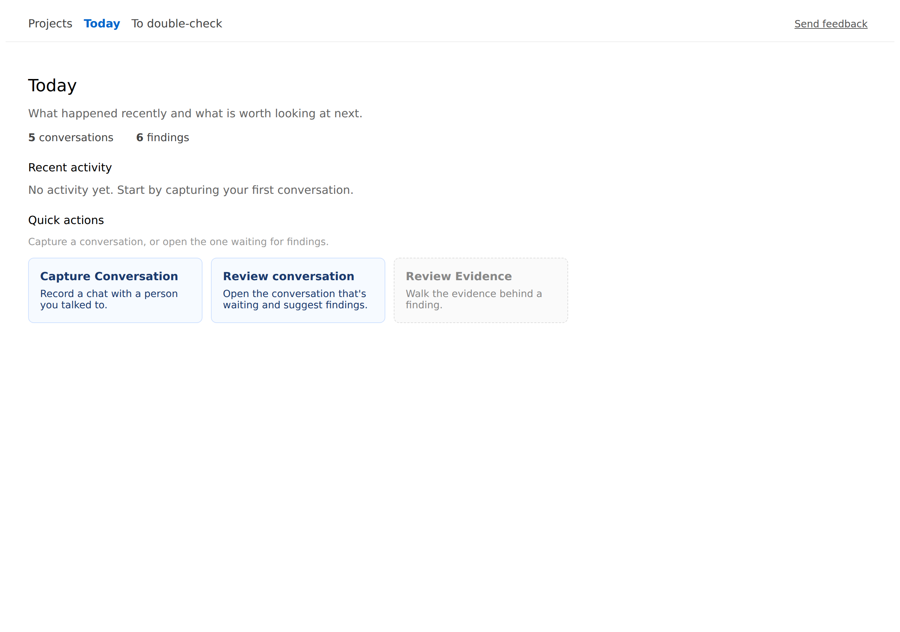
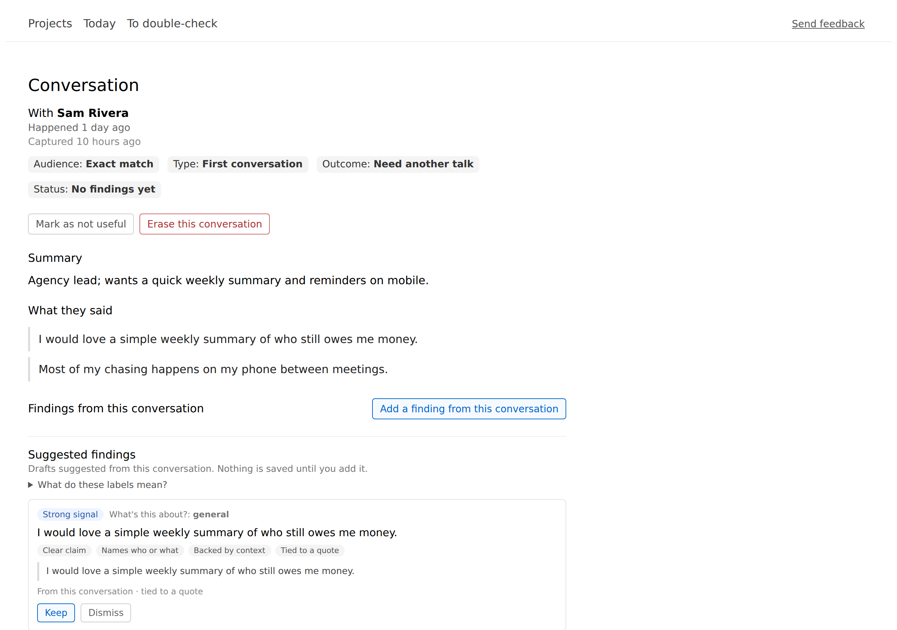
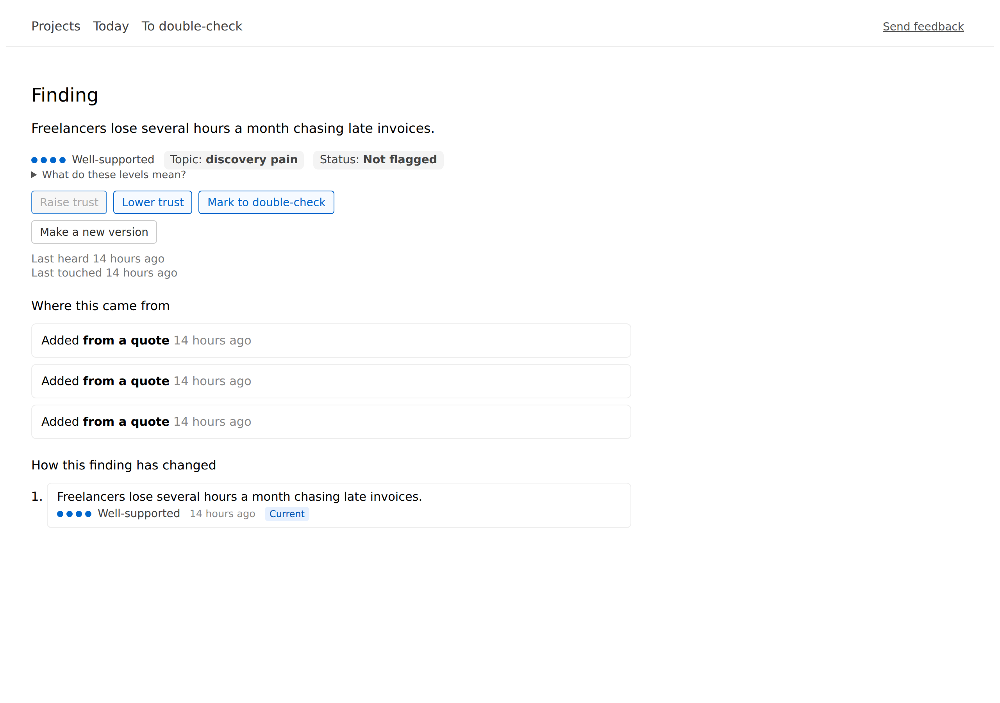
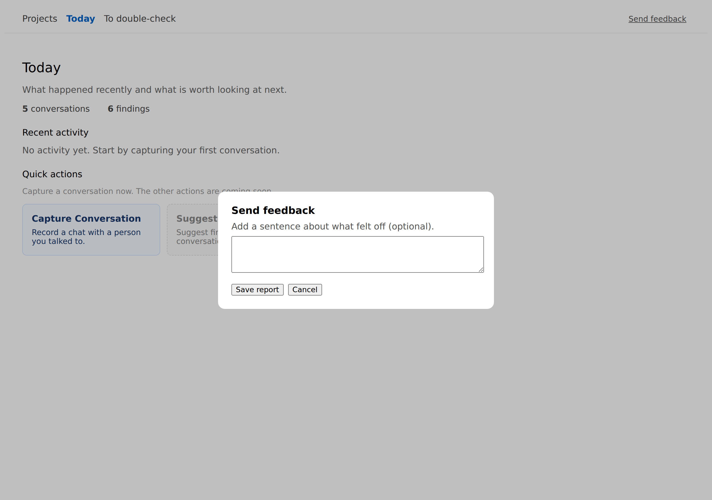

<div align="center">


# Turn customer conversations into findings you can trust.

A local-first app for founders and researchers: capture what people told you,
let ManthanOS suggest the findings inside each conversation, keep the ones that
matter, and see — at a glance — how well-backed each finding actually is.

It's built for customer interviews, discovery calls, usability sessions, and
other research conversations.

</div>

---

## What is ManthanOS?

ManthanOS helps you make sense of customer and user conversations. You record
what was said, and the app pulls out candidate **findings** — short, reviewable
statements like *"Pricing is the main blocker for small teams."* You decide
which ones to keep. Each finding you keep carries a **trust** level so you can
tell a well-supported insight from a shaky guess at a glance.

It runs entirely on your own computer. Nothing is uploaded, and there is no
account to create.

## What you can do today

- **Capture a conversation** — add who you talked to, what kind of conversation
  it was, and the notes or quotes.
- **Get suggested findings** — open a conversation and use **Suggest findings**;
  the app scans what was said and proposes findings for you to review.
- **Keep or dismiss** — accept the suggestions that hold up, skip the ones that
  don't. You are always in control of what gets kept.
- **See how well-backed each finding is** — every kept finding shows a **Trust**
  level (Well-supported → Noted → Shaky → Doubted).
- **Flag things to double-check** — mark a finding you're unsure about so you
  remember to revisit it.
- **Send feedback safely** — export a small, redacted report to share with the
  team, with no private conversation text in it.

> ManthanOS is **an early-stage app under active development.** It does what the
> list above describes today; it does not promise more. Broader testing is
> ongoing, so you may hit rough edges — the **Send feedback** button exists
> precisely so you can tell us about them.

## Screenshots / walkthrough

_Screenshots are not captured yet. The placeholders below mark what each image
will show; see the [Suggested screenshots](#suggested-screenshots) list._

| Screen | What it shows |
|--------|---------------|
|  | **Today** — your starting screen: recent conversations and findings. |
|  | A **conversation** with the **Suggest findings** panel open. |
|  | A **finding** with its **Trust** meter and the plain-language explainer. |
|  | The **Send feedback** dialog and what the exported report contains. |

## Requirements

- **Operating system:** macOS, Windows, or Linux.
- **[Node.js](https://nodejs.org) 22.13 or newer.**
- **[pnpm](https://pnpm.io) 11.x** (`npm install -g pnpm`).
- **git**, to download the project.
- A modern web browser (Chrome, Edge, Firefox, or Safari).

Everything runs locally. You do **not** need an API key, an account, or an
internet connection to use the app.

## Install

```bash
git clone https://github.com/DeadlyVirusIn/manthanos.git
cd manthanos
pnpm install
```

That installs everything the app needs. The next section starts it.

## Start the app

From the project folder, run:

```bash
pnpm cli:dev start
```

This is the `manthan start` launcher. It will:

1. start the local engine (the part that stores your data),
2. set up the **Demo — Customer discovery** project on first run,
3. start the web app, and
4. open it in your browser at **http://127.0.0.1:7374**.

You'll see a friendly *"Starting ManthanOS…"* message while it gets ready. When
the browser opens, you're all set. (Under the hood the engine listens on port
`7373` and the web app on `7374`; you don't need to think about either.)

> First startup may take 10–20 seconds while the local engine and web app come
> online.

To stop the app, return to the terminal and press **Ctrl + C**.

## First 5-minute walkthrough

The first launch drops you into a ready-made **Demo — Customer discovery**
project so you can try the whole loop without entering any of your own data.

1. **Land on Today.** After the welcome line, you arrive in the demo project.
2. **Open a conversation.** Open the conversation waiting for findings on Today to read what was said.
3. **Suggest findings.** One conversation in the demo is still waiting for
   findings. Open it and choose **Suggest findings** — the app proposes a few.
4. **Keep one.** Review a suggestion and **Keep** it if it holds up. It becomes
   a finding in the project.
5. **Look at its Trust.** Open the finding and read its **Trust** meter and the
   one-line explainer — that's how you'll judge every finding later.
6. **Flag something to double-check.** If a finding seems uncertain, mark it
   **to double-check** so it's easy to revisit.

That's the core loop: **capture → suggest → keep → trust → double-check.**

> Want to start over? While the app is running, you can reset the demo to its
> original state with `pnpm cli:dev reset-demo`.

## Understanding the interface

Four words do most of the work in ManthanOS:

- **Findings** — short statements pulled from your conversations (for example,
  *"Onboarding takes too long for new users."*). A finding is something you've
  chosen to keep, not raw notes.

- **Trust** — how well-backed a finding is, shown as a meter (more dots = more
  evidence). There are **four levels**:

  | Level | Meaning |
  |-------|---------|
  | **Well-supported** | Several sources back this up. |
  | **Noted** | Recorded, with limited backing so far. |
  | **Shaky** | Thin or mixed evidence. |
  | **Doubted** | Contradicted by what you heard. |

  > *"How well-backed this finding is. More dots = more evidence.
  > 'Well-supported' has several sources; 'Doubted' is contradicted by what you
  > heard."*

- **Confidence** — a separate nudge shown on **suggestions** (before you keep
  them) about how clearly something reads as a finding. It's a prompt to review,
  not a verdict, and it's deliberately different from Trust:
  **Strong signal**, **Looks reasonable**, or **Needs your eyes**.

  > *"How clearly this reads as a finding — a nudge to review, not a verdict.
  > 'Needs your eyes' means check it; 'Strong signal' means it looks solid."*

- **To double-check** — a flag you put on a finding you want to revisit. It
  doesn't change anything; it just reminds you (and your team) to take a second
  look.

**Trust vs Confidence, in one line:** *Trust* tells you how well-backed a finding
already is; *Confidence* only appears on suggestions and tells you how worth
reviewing a candidate looks.

## Privacy & local-first behavior

- **Everything stays on your machine.** Your conversations and findings are
  stored locally. There is no cloud sync, no account, and nothing is uploaded.
- **Works offline.** After installation, the core app works locally without a
  cloud connection.
- **Send feedback is safe to share.** When you export a feedback report, it
  contains only a small, redacted summary — app version, your browser/OS, the
  screen pattern you were on, and any note you write. It **excludes** your raw
  conversation text, quotes, names, file paths, ports, and internal IDs. You can
  read the file before sending it.

## Troubleshooting

| Symptom | What to do |
|---------|------------|
| **"Starting…" never finishes / the app won't come up** | Give it a few seconds, then stop with **Ctrl + C** and run `pnpm cli:dev start` again. The launcher waits for the engine and web app and reports if either didn't start in time. |
| **Browser didn't open** | Open **http://127.0.0.1:7374** yourself. |
| **"Something went wrong" banner** | Choose **Try again**. If it keeps happening, use **Send feedback** to save a report. |
| **Port already in use (7373 or 7374)** | Another copy may already be running — close it, or stop any process using those ports, then start again. |
| **The demo project is missing** | Restart the app; the demo is set up automatically on first run. While running, you can also run `pnpm cli:dev seed-demo`. |
| **"Suggest findings" isn't offered on a conversation** | That conversation already has findings (or was marked not useful). Open the one that's still pending, or capture a new conversation. |

If something still isn't right, the **Send feedback** button produces a safe,
redacted report you can share — that's the fastest way to get help during
testing.

## FAQ

**Is my data sent anywhere?** No. ManthanOS is local-first — your data stays on
your computer, and there's no cloud sync or account.

**Do I need an API key or to pay for anything?** No. The app runs entirely
locally with no external services.

**Is there an AI doing things on its own?** No. ManthanOS never acts on its own.
**Suggest findings** proposes candidates from the text you captured; *you* decide
what to keep, and nothing changes without your action.

**Can I use my own conversations?** Yes. The demo project is just a starting
point — you can capture your own conversations and work the same loop.

**Where is my data stored?** In local files on your machine, created the first
time you start the app.

**What does "Send feedback" share?** Only a small redacted report (see
[Privacy & local-first behavior](#privacy--local-first-behavior)) — never your
conversation text.

## Advanced & developer docs

Deeper technical material lives outside this README:

- [`docs/ARCHITECTURE.md`](docs/ARCHITECTURE.md) — how the engine, storage, and
  web app fit together.
- [`docs/`](docs/) — trust operations, safety model, and other deep dives.
- [`apps/api/README.md`](apps/api/README.md) / [`apps/web/README.md`](apps/web/README.md)
  — per-package developer notes (including the two-terminal dev flow).
- [`CONTRIBUTING.md`](CONTRIBUTING.md) — for contributors.

## Non-goals

To set expectations clearly, ManthanOS deliberately does **not**:

- run autonomous agents or take actions on your behalf,
- sync to the cloud or store your data on our servers,
- hide an AI making decisions for you — you keep, dismiss, and flag everything,
- require accounts, logins, or API keys,
- act as a multi-user / multi-tenant service.

It's a single-user, local-first tool by design.

---

<div align="center">

<a name="suggested-screenshots"></a>

ManthanOS is an early-stage app under active development.
Found a rough edge? Use **Send feedback** in the app.

</div>
