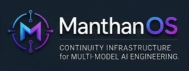

<div align="center">



A local CLI for solo engineers maintaining project continuity across
multiple AI tools — Claude, ChatGPT, Codex, Gemini. It records what each
AI session produces, lets you promote what's worth keeping, and presents
that record to whichever AI tool you open next.

</div>

---

## Status

Research-grade prototype, written by a solo engineer.
Local-first, audit-first, single-user. Currently honest about what it has and has not proven.

- **Code:** Phase 1 substrate + Phase 2 promotion UX are in tree and tested.
- **Phase 3 measurement:** the CpT harness ships; live cross-model results have not been run yet.
- **License:** BSL 1.1, converts to Apache 2.0 after four years.

**Operating principles** (what ManthanOS is, said in three lines):

- The **human is the operator.** No autonomous execution, no
  background mutation, no agent identity.
- The **AI tools are interchangeable collaborators.** Claude, ChatGPT,
  Codex, Gemini — none of them owns the project's state.
- The **repository is the unit of continuity.** Project facts and
  decisions persist with the repo; they do not follow any specific
  tool, model, or assistant.

See [`docs/ARCHITECTURE.md`](./docs/ARCHITECTURE.md) for how the
substrate is built and [`docs/PHASE3_CPT.md`](./docs/PHASE3_CPT.md)
for the measurement design. Full public-docs index at
[`docs/NOTES.md`](./docs/NOTES.md).

---

## 1. The workflow this exists for

Most engineers using AI seriously on a real codebase don't stay in one tool.
A representative day:

- ChatGPT for early framing.
- Claude (CLI or API) for implementation.
- Codex CLI for second-opinion review.
- Gemini CLI for adversarial critique.
- Four to eight browser tabs of half-finished sessions.
- A scratchpad of decisions none of those sessions know about.

The structural cost of this is small per action and large in aggregate:

- **Re-priming.** Every new session begins with a paragraph of
  "here is the project, here is what we decided, here is what is current."
  Each retelling is slightly different.
- **Contradiction.** Tool B confidently states something tool A
  explicitly rejected last week; the human is the only arbiter,
  and is doing it from memory.
- **Lossy handoff.** Taking a plan from one tool to another involves
  re-pasting context; the second tool reasons against whatever the
  human remembered to paste.
- **Decision archaeology.** "Did we decide X, or did we just consider X?"
  is answerable only by re-reading chat logs.

No model upgrade addresses this. A longer context window inside one tool
does not address it, because the work moves between tools. This is the
pain ManthanOS exists to handle.

---

## 2. What ManthanOS is today

A command-line tool that runs locally and exits. There is no daemon,
no service, and no cloud.

When you run `manthan init` in a git repository, it creates a `.manthan/`
directory with three things:

- A SQLite memory file (facts, decisions, open issues).
- An append-only JSONL audit log.
- A blob store keyed by SHA-256.

Together these form the workspace's **continuity record**. The
`manthan brain *` CLI surface operates on the curated portion of
that record (the trusted-facts layer the human promotes and
reviews); the audit chain captures every effectful change so the
record is recoverable end-to-end.

The day-to-day workflow:

```bash
cd ~/my-project
manthan init

# use whichever AI tool fits the conversation you're having

# when you want a structured plan, route it through manthan:
manthan plan "Add OAuth login with Google"

# review what the run captured into quarantine:
manthan brain review     # promote what's worth keeping, demote what's wrong

# next plan, same or different provider, sees the promoted facts:
manthan plan "Implement OAuth refresh" --show-trusted
```

Supported providers in the tree today:

| Adapter | How it's invoked |
|---|---|
| Claude (API) | `manthan plan --adapter=api` (needs `ANTHROPIC_API_KEY`) |
| Claude (CLI subscription) | `manthan plan` (default) |
| Codex CLI | `manthan plan --adapter=codex-cli` |
| Gemini CLI | `manthan plan --adapter=gemini-cli` |
| OpenAI | used by the measurement harness; not currently exposed as a `--adapter=` flag |

Capability surface:

- **Plan workflow.** Sends a deterministic context bundle to the chosen
  adapter, parses a structured plan, and extracts candidate facts into
  T0 (quarantine).
- **Trust ladder.** Six tiers, T-2 through T+3. Every promotion and
  demotion is human-gated and recorded with provenance.
- **Promotion UX.** `manthan brain review`, `manthan brain trust-log`,
  `manthan brain undo-correction <seq>` (7-day undo window).
- **Dedup.** Conservative Jaccard similarity, same-area only,
  human-confirmed merge.
- **Decay / aging.** With the `last_administratively_touched`
  migration that fixed the prior semantic bug.
- **Queue health.** `manthan brain queue-health` reports backlog,
  aging buckets, drain rate, and a degraded/stressed/healthy verdict.
- **Replay (integrity verification of recorded artifacts).**
  `manthan replay <runId>` reports one of four statuses:
  `verified` / `legacy` / `unverifiable` / `corrupted`. It
  recomputes the audit-chain hashes, each audit event's payload
  blob hash, the canonical-response hash inside the `agent.invoke`
  blob, and the bundle hash from stored per-layer metadata in
  `context_snapshots`. Corruption always wins (any explicit hash
  mismatch resolves the overall status to `corrupted`, even if
  other checks pass). What replay does **not** do: re-invoke the
  model, claim the model would produce the same response today,
  or check whether the underlying source / git state is unchanged
  since the run. No network calls.
- **CpT measurement harness.** `manthan experiments cpt-probe` runs the
  same brief across multiple workspaces and records objective
  shared-vocabulary metrics. Phase 3 only; produces signal, not scores.
- **Long-horizon simulator.** Synthetic stress-test that ages, decays,
  and triages months of activity in seconds.
- **Cross-platform.** Windows, macOS, Linux are equal targets;
  a single platform abstraction layer with genuine per-OS code.
- **Audit chain + startup recovery.** Hash-chained JSONL, SHA-256.
  On startup, recovery resolves to `clean` / `partial` /
  `corrupted` / `unrecoverable` and refuses mutating operations on
  the latter two. Detects chain hash mismatch, interior sequence
  gaps, genesis-anchor violation, JSONL parity mismatch with
  SQLite, and missing blob files; preserves findings to
  `.manthan/audit-corruption.log` outside the chain. Not tamper-
  proof against an attacker with workspace write access.

---

## 3. Validated vs unvalidated

Treating evidence as load-bearing is one of the project's working
disciplines. The current evidence boundary, as of the most recent
checkpoint:

### Validated

- **The substrate runs and persists state.** Workspaces survive crashes,
  the audit chain reconstructs across restarts, and `manthan replay`
  mechanically verifies the integrity of recorded artifacts (chain,
  blob hashes, canonical-response hash, bundle hash).
- **Trust transitions are deterministic and human-gated.** Promote,
  demote, undo, and dedup-merge are all chain entries with full
  provenance. The undo-correction path has an `INTERVENING_CORRECTION`
  safety check.
- **Dedup is conservative.** Jaccard threshold tuned so it surfaces
  contradictions without auto-merging real duplicates that share
  vocabulary by coincidence.
- **Long-horizon synthetic pressure does not break the substrate.**
  The simulator confirms the trusted layer self-bounds under months
  of synthetic introductions, corrections, and decay.
- **Cross-platform PAL is genuine.** Per-OS code paths exist for
  filesystem, locking, paths, and signals — not a thin wrapper.

### Not yet validated (do not claim)

- **Whether a healthy brain improves a second model's output.**
  The CpT harness exists; the live cross-model run (E6.1) has not
  been executed. Until it has, the project does **not** claim that
  populating the brain with one tool makes the next tool's output
  better. See [`docs/PHASE3_CPT.md`](./docs/PHASE3_CPT.md) and
  [`docs/TRUTH_CHECKPOINT.md` §6.4](./docs/TRUTH_CHECKPOINT.md#64-measurement).
- **Whether real users will use the promotion queue at the cadence
  the design assumes.** The promotion UX has not been used by
  anyone other than the author.
- **Cost dynamics across multiple providers in a single workflow.**
  Single-provider cost is visible per run; multi-provider cost
  patterns have not been studied.

### Honest sentence

> What ManthanOS records and presents is real.
> What that does to the next model's output is currently being measured.

If any sentence in this README or elsewhere conflicts with that one,
the conflicting sentence is overclaiming.

---

## 4. What is intentionally deferred

These are not on the roadmap. They were considered and explicitly
deferred. Reintroducing any of them requires a checkpoint memo with
a reason.

| Deferred | Reason |
|---|---|
| **Autonomous agents** | No demonstrated benefit over human-gated workflows in this codebase. |
| **Swarms / multi-agent panels** | Coordination cost dominates result quality at the scale a solo engineer operates. |
| **"AI Operating System" framing** | Vague, hype-coded, indefensible under technical review. |
| **Full orchestration runtime** | We have one workflow (`plan`). Generalizing before the first one has users is premature. |
| **Hidden automation** | No auto-promote, no auto-dedup, no auto-classify. Every trust-ladder transition is human-gated by design. |
| **Real-time daemons** | The CLI runs and exits. Adding a long-lived process is its own product. |
| **Cloud sync / SaaS / multi-tenant** | Local-first is a deliberate constraint. Multi-tenant changes the threat model. |
| **MCP server packaging** | Possible later. Not today. |
| **A UI** | Terminal only. UI work is on the long-term map below, but the README does not pretend it exists. |
| **Self-improving / learned shaping** | Shaping rules are deterministic and explainable. No semantic retrieval, no learned ranking. |

If you arrived here expecting any of those, you are in the wrong place —
deliberately. ManthanOS exists because the workflow pain in §1 is
addressable without any of them.

---

## 5. Long-term direction

This is direction, not promise. Every item listed here is *plausible
to grow into without breaking what's already correct*. None of it is
implemented. None of it is committed to a date.

### A shared continuity layer that survives between tools

Today the workspace already survives across `manthan plan` invocations
regardless of adapter — facts you promote while using Claude appear in
the next bundle even if the next bundle is sent to Codex or Gemini.
The aspirational direction here is **making that explicit and tested**:
once E6.1 produces a measured number, the README can say more than
"the facts are presented to the next model." Until then, the claim
stops at "presented."

### Cross-model handoff as a deliberate workflow step

Strategy in tool A → implementation plan in tool B → adversarial review
in tool C, with the workspace as the connective tissue. The substrate
supports this today (every adapter writes into the same audit chain
and reads from the same trusted-facts layer). What's missing is
**workflow ergonomics**: better stitching commands, better cross-run
diffing, better visualization of which session decided what.
This is design work, not research.

### Review workflows alongside plan workflows

The current `manthan plan` is one workflow. A `manthan review` workflow —
take a unit of work, hand it to a different adapter than the one that
produced it, capture critique into the same trust ladder — is a natural
next workflow, not a new product. Same trust ladder, same audit chain,
same human-gated promotion. The orchestrator package is structured to
support more workflows; only `plan` is wired today.

### Continuity across sessions and across tools — with the same primitives

The same audit chain, trust ladder, and dedup that handle within-tool
session-to-session continuity should handle tool-to-tool continuity.
The fact that this is already true at the code level is the reason
the README can describe a multi-tool workflow honestly; the fact that
it has not been *measured* end-to-end is the reason the README does
not claim it makes any specific tool's output better.

### Human-guided collaboration loops

Two or more humans working on one workspace is a known case the design
does not preclude. `.manthan/` is a directory; `git` already knows how
to synchronize directories. The conflict-resolution semantics for
trust-event interleaving across collaborators are not designed yet —
they are deferrable until a real two-person workflow needs them.

### What the long-term direction is *not*

- Not autonomous code generation.
- Not a multi-agent debate engine that picks the winner.
- Not a continuously running service.
- Not a hosted product.
- Not a model.
- Not a replacement for any AI tool you currently use.
- Not the "operating system of AI engineering." If that phrase shows
  up in any README revision, it should be reverted.

---

## 6. Why local-first and trust-gated matter

Both are constraints. Constraints are what keep a small tool useful.

**Local-first.** The workspace lives in `.manthan/` inside your repo.
A SQLite file, a JSONL audit log, a blob directory. No network calls
to ManthanOS infrastructure exist — because no ManthanOS infrastructure
exists. The only outbound network is the one your chosen adapter makes
to its provider when you run a plan. Consequences:

- You can read your own state with `sqlite3` or `cat`.
- You can `rm -rf .manthan` and start over with no obligation.
- `.manthan/` is local-only by default — `manthan init` writes a
  `.manthan/.gitignore` that excludes the workspace state from your
  repo. If you want to version it (rare; useful for shared brains),
  remove or edit that file and add `.manthan/` to your project
  tracking explicitly.
- Your project's decisions don't depend on this project being maintained.
- There is no account, no login, no "cloud sync paused" failure mode.

**Trust-gated.** No fact promotes itself. Every per-event transition
records an explicit `decision` field: `human-approved` for transitions
a human reviewed (promote, demote, undo, interactive dedup-merge), and
`auto-approve` for transitions an algorithm decided (decay sweeps,
T0 quarantine from plan extraction, system-bootstrap charter facts).
Decay can demote and archive facts, but it never *promotes*; new trust
only enters the system through a human-approved event. Consequences:

- A wrong fact in T0 cannot poison future prompts.
- A wrong promotion is undoable for 7 days with `manthan brain undo-correction`.
- The audit log can answer "why does the model think X about this project?"
  in a way that points at a specific human-approved event with a `seq`.
- The blast radius of a bad AI suggestion is bounded by the trust
  ladder — quarantined facts cannot leave T0 without you.

Without those two constraints, this project would either be a
hosted product with a different threat model, or an autonomous agent
with a different blast radius. With them, it is small enough to
read end-to-end and audit end-to-end.

---

## 7. Quickstart

### Prerequisites

```bash
node --version    # need v22.13+ (pnpm 11 requirement)
pnpm --version    # if missing: `npm install -g pnpm`
claude --version  # Claude Code CLI: https://claude.com/code
git --version
```

### Install

The CLI is not yet published to the npm registry. Two install paths
are supported today.

**A. From a local bundled tarball** (no source build on the user's
machine — fastest path for testers).

```bash
git clone https://github.com/DeadlyVirusIn/manthanos
cd manthanos
pnpm install
pnpm --filter @manthanos/cli pack:bundled    # produces apps/cli/manthanos-cli-X.Y.Z.tgz
npm install -g apps/cli/manthanos-cli-0.0.0.tgz
which manthan   # should resolve to your global npm bin dir
```

The bundled tarball inlines every workspace package; only
`better-sqlite3`, `@anthropic-ai/sdk`, `openai`, `commander`, and
`env-paths` are fetched from npm at install time.
`better-sqlite3` builds its native binding on first install; a C++
toolchain is required (xcode-tools on macOS, build-essential on
Debian/Ubuntu, MSVC build tools on Windows).

**B. From source** (contributor path).

```bash
git clone https://github.com/DeadlyVirusIn/manthanos
cd manthanos
pnpm install
pnpm build
cd apps/cli
npm link
which manthan
```

### Sanity check the install

```bash
manthan doctor    # reports environment + adapter availability without running an LLM call
```

If `manthan doctor` reports clean, the install is good. If it flags
missing adapters or PATH issues, fix those before the loop below.

### 60-second loop

> `manthan init` must run inside a git repository. If `~/my-project`
> isn't one yet, run `git init` there first.

```bash
cd ~/my-project
manthan init
manthan plan "Add OAuth login with Google"   # ~$0.10 if --adapter=api; covered by your Claude Code subscription otherwise
manthan brain review                          # promote facts you want to keep
manthan plan "Implement OAuth refresh" --show-trusted
```

Inside `manthan brain review`: `p N M …` promotes facts, `d N` demotes,
`s N` skips, `q` commits and exits, `?` shows full help.

Plan → review → next plan uses what you promoted.

`--adapter api`, `--adapter codex-cli`, and `--adapter gemini-cli`
are supported alternatives. See `manthan plan --help`.

### Demo

[](https://asciinema.org/a/Dj71EeNrZWlI6SUQ?autoplay=1)

90 seconds. Two `manthan plan` calls on the same project. The second
one continues the first one's framework decisions instead of inventing
new ones.

Note: this demo uses a single adapter. A multi-tool demo will appear
once the cross-tool benefit has been measured rather than asserted.

---

## Documentation

- [`docs/ARCHITECTURE.md`](./docs/ARCHITECTURE.md) — how the substrate
  is built.
- [`docs/SAFETY_MODEL.md`](./docs/SAFETY_MODEL.md) — threat model and
  honest disclaimers.
- [`docs/CONTINUITY_THEORY.md`](./docs/CONTINUITY_THEORY.md) — why
  trust ladder + audit chain is the design.
- [`docs/TRUTH_CHECKPOINT.md`](./docs/TRUTH_CHECKPOINT.md) — what is
  validated, invalidated, and unproven.
- [`docs/PHASE3_CPT.md`](./docs/PHASE3_CPT.md) — the measurement
  design.
- [`docs/LICENSING_STRATEGY.md`](./docs/LICENSING_STRATEGY.md) —
  why BSL.

Full public-docs index at [`docs/NOTES.md`](./docs/NOTES.md).

---

## License

© 2026 DeadlyVirusIn. ManthanOS is released under BSL 1.1.
See [LICENSE](./LICENSE) and [NOTICE](./NOTICE).

[**BSL 1.1**](./LICENSE) — Business Source License. Source-available,
free for personal and internal use; commercial hosting of
ManthanOS-as-a-service requires permission until the four-year change
date, at which point each release auto-converts to **Apache 2.0**.
This is the same stack used by HashiCorp, Sentry, and CockroachDB.
See [`docs/LICENSING_STRATEGY.md`](./docs/LICENSING_STRATEGY.md) for
the full reasoning.

"ManthanOS" is a project name; see [`TRADEMARKS.md`](./TRADEMARKS.md).

---

<sub>
If anything in this README reads as overclaim, file an issue with the
sentence quoted. The project's working discipline is that evidence is
load-bearing and over-narrowing is correctable; both directions can be
wrong, and both are worth flagging.
</sub>
